# Diagram Design Analysis & Improvement Recommendations

**Analysis Date:** 2026-01-20  
**Analyst Perspective:** UX/UI Designer  
**Diagrams Analyzed:** Master diagram + 5 operator views

---

## 🎨 Executive Summary

**Overall Assessment:** Strong structural foundation with clear semantic meaning, but needs visual hierarchy improvements and cognitive load reduction.

**Key Strengths:**
- ✅ Excellent semantic categorization (HUMAN_ACTION, SYSTEM_FLOW, CONTEXT_REF)
- ✅ Consistent legend implementation
- ✅ Clear state-specific focus in operator views
- ✅ Logical information architecture

**Key Weaknesses:**
- ⚠️ Poor visual hierarchy (everything competes for attention)
- ⚠️ Color contrast issues (white on gray hard to read)
- ⚠️ Dense information without breathing room
- ⚠️ Legend placement (bottom) reduces discoverability
- ⚠️ Inconsistent styling application

---

## 🔍 Detailed Analysis

### 1. Visual Hierarchy Issues

#### Problem: Everything Has Equal Weight
**Current State:**
- All nodes use similar sizes
- Subgraphs all have similar visual weight
- No clear "entry point" or scan pattern
- Human actions don't stand out enough despite thick borders

**Impact:**
- High cognitive load
- Users don't know where to look first
- Important information gets lost

**Evidence:**
```mermaid
classDef HUMAN_ACTION fill:#FFFFFF,stroke:#000000,stroke-width:4px,color:#000000
classDef SYSTEM_FLOW fill:#F2F2F2,stroke:#333333,stroke-width:2px,color:#000000
```
- White fill on white background = invisible
- Gray fill too subtle
- 4px vs 2px difference not dramatic enough

---

### 2. Color & Contrast Problems

#### Problem: Poor Accessibility
**Current Issues:**
- `fill:#F2F2F2` (SYSTEM_FLOW) - Very light gray, low contrast
- `fill:#FFFFFF` (HUMAN_ACTION) - White on white backgrounds
- `stroke:#999999` (CONTEXT_REF) - Light gray strokes barely visible
- `color:#666666` - Dark gray text on white is acceptable but weak

**WCAG Contrast Ratios (Estimated):**
- ❌ SYSTEM_FLOW: ~1.5:1 (fails WCAG AA - needs 4.5:1)
- ⚠️ HUMAN_ACTION: ~21:1 (passes, but lacks emphasis color)
- ❌ CONTEXT_REF stroke: ~1.2:1 (fails - barely visible)

---

### 3. Layout & Spacing Issues

#### Problem: Density Without Hierarchy
**Current State:**
- `padding: 16` is too small for complex diagrams
- Subgraphs tightly packed
- No visual breathing room
- Dense text labels (long descriptions)

**Impact:**
- Overwhelming at first glance
- Hard to parse quickly
- Feels like a wall of information

---

### 4. Legend Placement & Discoverability

#### Problem: Legend Buried at Bottom
**Current State:**
- Legend appears at the end of diagram code
- Rendered at bottom of visual
- Users must scroll/search to find it
- Not immediately visible on first view

**Impact:**
- Users don't understand semantics until they find legend
- Confusion about what colors/shapes mean
- Reduced usability

**Better Approach:**
- Move legend to top-right corner
- Make it floating/persistent
- Or place immediately after title nodes

---

### 5. Inconsistent Styling Application

#### Problem: Styling Classes Not Fully Applied
**Current State:**
- Master diagram has old color classes (human, ai, system) AND new semantic classes
- Some nodes have both, causing conflicts
- Operator views don't use old color system consistently
- Mix of old and new creates confusion

**Example Conflict:**
```mermaid
HR_PRE{Approve Concept Direction?}:::decision
class HR_PRE HUMAN_ACTION
```
- Node gets `decision` class (red fill)
- Then gets `HUMAN_ACTION` class (white fill)
- Result: Unpredictable rendering

---

### 6. Cognitive Load Analysis

#### Master Diagram (985 lines)
**Complexity Score:** ⚠️ Very High

**Issues:**
- 10+ major subgraphs
- 100+ nodes
- Multiple layers (spine, services, agents, memory, execution)
- Too much for single view

**Operator Views (Average 180 lines)**
**Complexity Score:** ✅ Good

**Strengths:**
- Focused scope
- 3-5 subgraphs
- 20-30 nodes
- More manageable

---

## 💡 Improvement Recommendations

### Priority 1: Fix Color & Contrast

#### Recommendation: Use High-Contrast Color Palette

**Replace Current:**
```mermaid
classDef HUMAN_ACTION fill:#FFFFFF,stroke:#000000,stroke-width:4px,color:#000000
classDef SYSTEM_FLOW fill:#F2F2F2,stroke:#333333,stroke-width:2px,color:#000000
classDef CONTEXT_REF fill:#FFFFFF,stroke:#999999,stroke-width:1px,stroke-dasharray:5 5,color:#666666
```

**With Improved:**
```mermaid
classDef HUMAN_ACTION fill:#FFE5E5,stroke:#DC2626,stroke-width:4px,color:#000000,font-weight:bold
classDef SYSTEM_FLOW fill:#E0F2FE,stroke:#0369A1,stroke-width:2.5px,color:#000000
classDef CONTEXT_REF fill:#F9FAFB,stroke:#6B7280,stroke-width:1.5px,stroke-dasharray:5 5,color:#4B5563,font-style:italic
```

**Rationale:**
- HUMAN_ACTION: Red tint draws attention (urgency)
- SYSTEM_FLOW: Blue maintains "system" association, better contrast
- CONTEXT_REF: Light gray with stronger border, italic text = subtle

---

### Priority 2: Improve Visual Hierarchy

#### Recommendation: Size & Weight Differentiation

**Add Hierarchy Classes:**
```mermaid
%% Primary nodes (states, critical decisions)
classDef PRIMARY fill:#1E40AF,stroke:#1E3A8A,stroke-width:3px,color:#FFFFFF,font-weight:bold,font-size:14px

%% Secondary nodes (artifacts, processes)
classDef SECONDARY fill:#3B82F6,stroke:#2563EB,stroke-width:2px,color:#FFFFFF,font-size:12px

%% Tertiary nodes (context, memory)
classDef TERTIARY fill:#93C5FD,stroke:#60A5FA,stroke-width:1.5px,color:#000000,font-size:11px
```

**Apply to States:**
- PRE_EVT, INTRO_EVT, etc. → PRIMARY
- Artifacts, AI services → SECONDARY
- Memory, context → TERTIARY

---

### Priority 3: Legend Repositioning

#### Recommendation: Move Legend to Top

**New Structure:**

```mermaid
flowchart TB
%% Title
TITLE["📊 System Architecture"]

%% Legend (TOP)
subgraph LEGEND["📖 Visual Semantics"]
direction LR
LEG_HUMAN["✋ Human Action"]:::HUMAN_ACTION
LEG_SYSTEM["⚙️ System Flow"]:::SYSTEM_FLOW
LEG_CONTEXT["◻ Context"]:::CONTEXT_REF
end

%% Main content
subgraph MAIN["..."]
...
end

TITLE --> LEGEND
LEGEND -.-> MAIN
```


**Benefits:**
- Legend seen first
- Users understand semantics before exploring
- Better onboarding

---

### Priority 4: Reduce Cognitive Load

#### Recommendation: Progressive Disclosure

**Master Diagram Changes:**
1. **Collapsible Sections** (not native Mermaid, but can simulate):
   - Separate into multiple focused diagrams
   - Create "overview" + "detailed" versions

2. **Simplify Initial View:**
   ```mermaid
   %% Simplified spine-only view first
   PRE_EVT --> INTRO_EVT --> COMM_EVT --> FLOOR_EVT --> FINAL_EVT --> IMPL_EVT
   
   %% Then expand with "zoom in" diagrams
   ```

3. **Better Grouping:**
   - Group related subgraphs visually
   - Use consistent spacing between groups
   - Add section dividers/comments

---

### Priority 5: Typography & Readability

#### Recommendation: Improved Text Styling

**Current Issues:**
- Long labels wrap awkwardly
- No text size hierarchy
- Mixed line breaks (`<br/>`) inconsistent

**Improvements:**
```mermaid
%% Shorten labels
PRE_SIGNAL_SCAN("Signal Scan<br/>Industry · Courts"):::system
%% Instead of:
PRE_SIGNAL_SCAN("Signal Scanning<br/>Industry · Courts · Agencies"):::human

%% Use abbreviations with tooltips (if supported)
%% Or create glossary

%% Consistent text sizing
classDef LABEL_LARGE font-size:14px,font-weight:bold
classDef LABEL_MEDIUM font-size:12px
classDef LABEL_SMALL font-size:10px,font-style:italic
```

---

### Priority 6: Layout Optimization

#### Recommendation: Strategic Layout Choices

**Current:** `layout: dagre` (auto-arranges everything)

**Better Approach:**
1. **Use Directional Flow:**
   ```mermaid
   %% Legislative spine: Left to Right
   subgraph SPINE["📜 Legislative Spine"]
   direction LR
   PRE_EVT --> INTRO_EVT --> COMM_EVT
   end
   
   %% Supporting systems: Top to Bottom
   subgraph SUPPORT["🤖 AI Services"]
   direction TB
   AI_INGEST --> AI_RETRIEVE --> AI_GENERATE
   end
   ```

2. **Increase Padding:**
   ```mermaid
   config:
     padding: 32  %% Doubled from 16
   ```

3. **Group Related Elements:**
   - Visual clusters for related subgraphs
   - Consistent spacing between groups

---

## 🔧 Code Improvements

### Improved Master Diagram Styling

```mermaid
---
config:
  layout: dagre
  elk:
    nodePlacementStrategy: NETWORK_SIMPLEX
    mergeEdges: true
    padding: 32
---
flowchart TB

%% =====================================================
%% IMPROVED STYLING CLASSES
%% =====================================================

%% Primary (States, Critical Decisions)
classDef PRIMARY fill:#1E40AF,stroke:#1E3A8A,stroke-width:3px,color:#FFFFFF,font-weight:bold,font-size:14px

%% Human Actions (Review Gates)
classDef HUMAN_ACTION fill:#FEE2E2,stroke:#DC2626,stroke-width:4px,color:#000000,font-weight:bold,font-size:13px

%% System Flow (AI Services, Execution)
classDef SYSTEM_FLOW fill:#DBEAFE,stroke:#2563EB,stroke-width:2.5px,color:#000000,font-size:12px

%% Context Reference (Memory, Learning)
classDef CONTEXT_REF fill:#F3F4F6,stroke:#6B7280,stroke-width:1.5px,stroke-dasharray:5 5,color:#4B5563,font-size:11px,font-style:italic

%% Artifacts
classDef ARTIFACT fill:#E0E7FF,stroke:#6366F1,stroke-width:2px,color:#000000,font-size:12px

%% Data Stores
classDef DATA fill:#FEF3C7,stroke:#F59E0B,stroke-width:2px,color:#000000,font-size:11px

%% Apply to nodes
class PRE_EVT,INTRO_EVT,COMM_EVT,FLOOR_EVT,FINAL_EVT,IMPL_EVT PRIMARY
class HR_PRE,HR_LANG,HR_MSG,HR_RELEASE HUMAN_ACTION
class AI_INGEST,AI_RETRIEVE,AI_FEATURES,AI_GENERATE,AI_SCORE,EXEC_STRATEGY,EXEC_TACTICS,EXEC_RUN,EXEC_MONITOR SYSTEM_FLOW
class MEMORY,MEM_EVIDENCE,MEM_TACTICS,MEM_NARRATIVE,MEM_OUTCOMES CONTEXT_REF
class PRE_CONCEPT,INTRO_FRAME,COMM_LANG ARTIFACT
```

---

### Improved Operator View Template

```mermaid
---
config:
  layout: dagre
  elk:
    nodePlacementStrategy: NETWORK_SIMPLEX
    mergeEdges: true
    padding: 32
---
flowchart TB

%% =====================================================
%% TITLE & LEGEND (TOP)
%% =====================================================

TITLE["📊 PRE_EVT Operator View<br/>Policy Opportunity Detected"]

subgraph LEGEND["📖 Visual Semantics"]
direction LR
LEG_HUMAN["✋ Human Action"]:::HUMAN_ACTION
LEG_SYSTEM["⚙️ System Flow"]:::SYSTEM_FLOW
LEG_CONTEXT["◻ Context"]:::CONTEXT_REF
end

TITLE --> LEGEND

%% =====================================================
%% MAIN CONTENT
%% =====================================================

%% [rest of diagram]

%% =====================================================
%% STYLING (SAME AS IMPROVED MASTER)
%% =====================================================
```



---

## 📊 Implementation Priority

| Priority | Task | Impact | Effort |
|----------|------|--------|--------|
| P1 | Fix color contrast | High | Low |
| P1 | Reposition legend | High | Low |
| P2 | Improve visual hierarchy | High | Medium |
| P2 | Reduce cognitive load | High | High |
| P3 | Optimize layout | Medium | Medium |
| P3 | Typography improvements | Medium | Low |

---

## ✅ Testing Checklist

After implementing improvements:

- [ ] Check WCAG AA contrast ratios (4.5:1 for text)
- [ ] Verify legend visible on first view
- [ ] Test on different screen sizes
- [ ] Validate with colorblind simulation tools
- [ ] Get user feedback on readability
- [ ] Compare before/after cognitive load

---

## 📚 References

- **WCAG 2.1:** https://www.w3.org/WAI/WCAG21/quickref/
- **Mermaid Best Practices:** https://mermaid.js.org/config/usage.html
- **Visual Hierarchy Principles:** Tufte, Edward - "Envisioning Information"

---

**Next Steps:**
1. Implement Priority 1 fixes (color & legend)
2. Test with actual users
3. Iterate based on feedback
4. Apply improvements to all diagrams consistently
