# Diagram Improvement Implementation Guide

**Based on:** DIAGRAM_DESIGN_ANALYSIS.md  
**Status:** Ready for Implementation  
**Priority:** High

---

## 🎯 Quick Wins (Low Effort, High Impact)

### 1. Fix Color Contrast (30 minutes)

**Files to Update:**
- `agent orchestrator 1.6.mmd`
- All `*_operator_view.mmd` files

**Change:**
```mermaid
%% OLD (Low contrast)
classDef HUMAN_ACTION fill:#FFFFFF,stroke:#000000,stroke-width:4px,color:#000000
classDef SYSTEM_FLOW fill:#F2F2F2,stroke:#333333,stroke-width:2px,color:#000000

%% NEW (High contrast)
classDef HUMAN_ACTION fill:#FEE2E2,stroke:#DC2626,stroke-width:4px,color:#000000,font-weight:bold
classDef SYSTEM_FLOW fill:#DBEAFE,stroke:#2563EB,stroke-width:2.5px,color:#000000
```

**Impact:** ✅ WCAG AA compliant, much better readability

---

### 2. Move Legend to Top (15 minutes)

**Change:**
Move legend subgraph to appear after title, before main content.

**Impact:** ✅ Users understand semantics immediately

---

### 3. Increase Padding (1 minute)

**Change:**
```mermaid
config:
  padding: 32  %% Was: 16
```

**Impact:** ✅ Better visual breathing room

---

## 🔧 Full Implementation Checklist

### Phase 1: Color & Contrast (Day 1)

- [ ] Update HUMAN_ACTION class (red tint, bold)
- [ ] Update SYSTEM_FLOW class (blue, better contrast)
- [ ] Update CONTEXT_REF class (stronger border, italic)
- [ ] Add PRIMARY class for states
- [ ] Test color contrast ratios
- [ ] Verify with colorblind simulation

**Files:**
- All `.mmd` files

---

### Phase 2: Layout & Hierarchy (Day 2)

- [ ] Move legends to top of all diagrams
- [ ] Increase padding from 16 to 32
- [ ] Add title nodes to all operator views
- [ ] Apply PRIMARY class to all state nodes
- [ ] Group related subgraphs visually

**Files:**
- All `*_operator_view.mmd` files
- Master diagram

---

### Phase 3: Typography & Readability (Day 3)

- [ ] Shorten long labels
- [ ] Add font-size hierarchy
- [ ] Standardize line breaks
- [ ] Add consistent text styling

**Files:**
- All `.mmd` files

---

### Phase 4: Testing & Validation (Day 4)

- [ ] Test all diagrams render correctly
- [ ] Verify accessibility (WCAG AA)
- [ ] Check on different screen sizes
- [ ] Get user feedback
- [ ] Document any issues

---

## 📝 Code Snippets

### Improved Styling Template

```mermaid
%% =====================================================
%% IMPROVED STYLING CLASSES (HIGH CONTRAST)
%% =====================================================

%% Primary (States - High emphasis)
classDef PRIMARY fill:#1E40AF,stroke:#1E3A8A,stroke-width:3px,color:#FFFFFF,font-weight:bold,font-size:14px

%% Human Actions (Review Gates - Urgent attention)
classDef HUMAN_ACTION fill:#FEE2E2,stroke:#DC2626,stroke-width:4px,color:#000000,font-weight:bold,font-size:13px

%% System Flow (AI Services, Execution - Active processes)
classDef SYSTEM_FLOW fill:#DBEAFE,stroke:#2563EB,stroke-width:2.5px,color:#000000,font-size:12px

%% Context Reference (Memory, Learning - Background)
classDef CONTEXT_REF fill:#F3F4F6,stroke:#6B7280,stroke-width:1.5px,stroke-dasharray:5 5,color:#4B5563,font-size:11px,font-style:italic

%% Artifacts (Documents, Outputs)
classDef artifact fill:#E0E7FF,stroke:#6366F1,stroke-width:2px,color:#000000,font-size:12px

%% Data Stores
classDef DATA fill:#FEF3C7,stroke:#F59E0B,stroke-width:2px,color:#000000,font-size:11px
```

### Improved Config Template

```mermaid
---
config:
  layout: dagre
  elk:
    nodePlacementStrategy: NETWORK_SIMPLEX
    mergeEdges: true
    padding: 32
---
```

### Improved Structure Template

```mermaid
flowchart TB

%% Title
TITLE["📊 Diagram Title"]

%% Legend (TOP)
subgraph LEGEND["📖 Visual Semantics"]
direction LR
LEG_HUMAN["✋ Human Action"]:::HUMAN_ACTION
LEG_SYSTEM["⚙️ System Flow"]:::SYSTEM_FLOW
LEG_CONTEXT["◻ Context"]:::CONTEXT_REF
end

TITLE -.-> LEGEND

%% Main Content
%% [rest of diagram]
```



---

## 🧪 Testing Tools

1. **Color Contrast Checker:**
   - https://webaim.org/resources/contrastchecker/
   - Target: 4.5:1 for text (WCAG AA)

2. **Colorblind Simulator:**
   - https://www.color-blindness.com/coblis-color-blindness-simulator/

3. **Mermaid Live Editor:**
   - https://mermaid.live
   - Test rendering before committing

4. **Accessibility Validator:**
   - WAVE browser extension
   - axe DevTools

---

## 📊 Before/After Comparison

### Before:
- ❌ White on white (invisible)
- ❌ Gray on white (low contrast)
- ❌ Legend at bottom (hidden)
- ❌ Padding 16 (cramped)
- ❌ All nodes equal weight

### After:
- ✅ Red tint for human actions (high contrast)
- ✅ Blue for system flow (good contrast)
- ✅ Legend at top (discoverable)
- ✅ Padding 32 (breathing room)
- ✅ Primary/secondary/tertiary hierarchy

---

## 🚀 Implementation Order

1. **Start with:** PRE_EVT operator view (simplest)
2. **Then:** Apply to all operator views
3. **Finally:** Master diagram (most complex)

This allows you to:
- Test improvements on simpler diagram first
- Refine approach before tackling complex master
- Validate changes incrementally

---

## ✅ Success Criteria

- [ ] All diagrams pass WCAG AA contrast (4.5:1)
- [ ] Legend visible on first view in all diagrams
- [ ] Clear visual hierarchy (primary > secondary > tertiary)
- [ ] Consistent styling across all diagrams
- [ ] Positive user feedback on readability
- [ ] No rendering errors in Mermaid Live Editor

---

**Ready to implement?** Start with Phase 1 (Color & Contrast) - it's the quickest win with highest impact!
