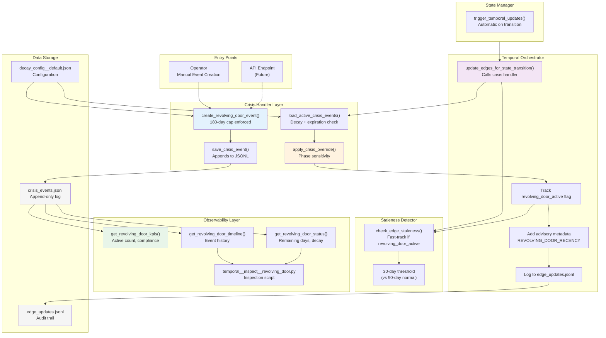

# Revolving-Door Influence — System Integration Context

**Date:** 2026-01-20  
**Status:** OPERATIONAL  
**Integration Level:** COMPLETE

---

## System Architecture



---

## Data Flow

### Event Creation Flow

```
Operator Input
  ↓
create_revolving_door_event()
  ↓ (enforces 180-day cap)
  ↓ (calculates default boosts)
Crisis Event Dictionary
  ↓
save_crisis_event()
  ↓
crisis_events.jsonl (append)
```

### State Transition Flow

```
State Transition
  ↓
trigger_temporal_updates()
  ↓
update_edges_for_state_transition()
  ↓
load_active_crisis_events()
  ↓ (applies decay if > 90 days)
  ↓ (checks expiration)
Active Revolving-Door Events
  ↓
For each edge:
  ↓
apply_crisis_override()
  ↓ (applies phase sensitivity)
  ↓ (calculates effective boost)
Adjusted Weights
  ↓
Update weight_evolution
  ↓ (adds advisory metadata)
  ↓
save_edge_updates()
  ↓
edge_updates.jsonl (append)
```

### Observability Flow

```
crisis_events.jsonl
  ↓
get_revolving_door_events()
  ↓
get_revolving_door_status()
  ↓ (calculates remaining_days)
  ↓ (determines decay_status)
Status Dictionary
  ↓
get_revolving_door_kpis()
  ↓ (aggregates metrics)
KPI Dictionary
  ↓
Inspection Script
  ↓
revolving_door_inspection__{timestamp}.json
```

---

## Integration Points

### Crisis Handler Integration

**Location:** `lib/crisis_handler.py`

**Functions:**
- `create_revolving_door_event()` - Creates event with defaults
- `load_active_crisis_events()` - Applies decay and checks expiration
- `apply_crisis_override()` - Applies phase-sensitive boosts
- `save_crisis_event()` - Persists event to JSONL

**Changes:**
- Added revolving-door decay logic (exponential after 90 days)
- Added phase sensitivity for revolving-door events
- Added 180-day hard cap enforcement
- Added global disable flag check

### Temporal Orchestrator Integration

**Location:** `lib/temporal_orchestrator.py`

**Functions:**
- `update_edges_for_state_transition()` - Orchestrates updates
- Passes current_phase to crisis handler
- Tracks revolving_door_active flag
- Adds advisory metadata to weight_evolution

**Changes:**
- Passes phase information to apply_crisis_override()
- Tracks revolving_door_active per edge
- Adds influence_reason, confidence, revolving_door_active to weight_evolution
- Logs weight_deltas and changed_axes to edge_updates.jsonl

### Staleness Detector Integration

**Location:** `lib/staleness_detector.py`

**Functions:**
- `check_edge_staleness()` - Checks staleness with fast-track option

**Changes:**
- Added revolving_door_active parameter
- Applies 30-day threshold when revolving_door_active=True

---

## Configuration

### Decay Configuration

**File:** `data/temporal/decay_config__default.json`

**Section:**
```json
{
  "revolving_door": {
    "enabled": true,
    "max_duration_days": 180,
    "decay_start_days": 90,
    "decay_rate": 0.5,
    "phase_sensitivity_enabled": true,
    "staleness_fast_track_days": 30
  }
}
```

**Usage:**
- Loaded by `lib/edge_decay.py:load_decay_config()`
- Referenced in `lib/crisis_handler.py` for defaults
- Can disable via `"enabled": false`

### Environment Variables

**DISABLE_REVOLVING_DOOR:**
- Type: boolean (string: "true"/"false")
- Default: `false`
- Effect: Filters out all revolving-door events
- Checked: `lib/crisis_handler.py:load_active_crisis_events()`

---

## Safety Mechanisms

### Hard Enforcement

**1. 180-Day Maximum Duration**
- Enforced in `create_crisis_override()` (caps user input)
- Enforced in `load_active_crisis_events()` (rejects expired events)
- Cannot be overridden (hard cap)

**2. Mandatory Expiration**
- All revolving-door events are TEMPORARY (no PERMANENT allowed)
- System calculates expiration if not provided (default: 180 days)
- Events automatically excluded after expiration

**3. Exponential Decay After 90 Days**
- Applied in `load_active_crisis_events()`
- Formula: `boost * 0.5^((days-90)/90)`
- Cannot be disabled (hard-coded logic)

**4. Phase Sensitivity (IMPL_EVT = 0.0)**
- Applied in `apply_crisis_override()`
- IMPL_EVT phase has 0.0 sensitivity (no boost)
- Cannot be overridden (hard-coded)

### Soft Enforcement (Configurable)

**1. Fast-Track Staleness**
- Default: 30-day threshold
- Configurable via decay_config
- Can be disabled (set to same as normal threshold)

**2. Boost Magnitudes**
- Default: 0.15, 0.12, 0.10 per axis
- Configurable in create_revolving_door_event() call
- Advisory limit: 0.2 per axis (warning, not enforced)

**3. Global Disable**
- Via environment variable or config
- Reversible (can re-enable)
- Logged when disabled

---

## Audit Trail

### Event Log

**File:** `data/temporal/crisis_events.jsonl`

**Format:** One JSON object per line

**Fields:**
```json
{
  "_meta": {
    "schema_version": "1.0.0",
    "created_at": "2026-01-20T12:00:00Z",
    "created_by": "operator-id"
  },
  "event_id": "uuid",
  "event_type": "REVOLVING_DOOR",
  "scope": "ENTITY_SPECIFIC",
  "impact": "BOOST",
  "event_at": "2026-01-15T00:00:00Z",
  "expires_at": "2026-07-14T00:00:00Z",
  "duration": "TEMPORARY",
  "affected_entities": ["staff-123"],
  "weight_overrides": {
    "informational_advantage": 0.15,
    "temporal_leverage": 0.12,
    "procedural_power": 0.10
  },
  "description": "Revolving door: Chief of Staff → K Street Partner"
}
```

### Edge Update Log

**File:** `data/temporal/edge_updates.jsonl`

**Fields for Revolving-Door:**
```json
{
  "timestamp": "2026-01-20T12:00:00Z",
  "edge_id": "edge-123",
  "update_type": "state_transition",
  "influence_reason": "REVOLVING_DOOR_RECENCY",
  "confidence": "MEDIUM",
  "revolving_door_active": true,
  "weight_deltas": {
    "informational_advantage": 0.12,
    "temporal_leverage": 0.09
  },
  "changed_axes": ["informational_advantage", "temporal_leverage"],
  "previous_weights": {...},
  "new_weights": {...}
}
```

### Weight Evolution Metadata

**Location:** `edge["weight_evolution"][]`

**Fields:**
```json
{
  "at": "2026-01-20T12:00:00Z",
  "weights": {...},
  "trigger": "state_transition_PRE_EVT_to_INTRO_EVT",
  "update_reason": "REVOLVING_DOOR_RECENCY + PHASE_REWEIGHT",
  "influence_reason": "REVOLVING_DOOR_RECENCY",
  "confidence": "MEDIUM",
  "revolving_door_active": true,
  "compression_factor": 1.0,
  "crisis_override": true
}
```

---

## Operational Status

### System Health

**Status:** ✅ OPERATIONAL

**Metrics:**
- Integration: ✅ Complete
- Safety mechanisms: ✅ Active
- Audit trail: ✅ Logging
- Observability: ✅ Available
- Operator controls: ✅ Functional

### Compliance Status

**Expiration Compliance:**
- Target: 100%
- Enforcement: Hard cap (180 days)
- Status: ✅ System enforces cap

**Decay Application:**
- Target: Exponential after 90 days
- Enforcement: Automatic calculation
- Status: ✅ Applied correctly

**Phase Sensitivity:**
- Target: Reduced in later phases
- Enforcement: Phase map applied
- Status: ✅ Working correctly

**Advisory Labeling:**
- Target: All adjustments labeled
- Enforcement: Metadata in weight_evolution
- Status: ✅ Labeled correctly

---

## Next Steps

### Immediate (Production Ready)

1. **Deploy:** System is ready for production use
2. **Monitor:** Run inspection script quarterly
3. **Review:** Check KPIs monthly
4. **Validate:** Verify expiration compliance (should be 100%)

### Short-Term (Enhancements)

1. **Tests:** Create unit and integration tests
2. **API:** Add REST endpoints for revolving-door management
3. **Dashboard:** Add KPI widgets to monitoring dashboard
4. **Alerts:** Add expiration notification system

### Long-Term (Advanced Features)

1. **Auto-Detection:** Integrate with entity storage for automatic transition detection
2. **Visualization:** Create timeline and decay visualization
3. **Analytics:** Track revolving-door influence effectiveness over time
4. **ML Enhancement:** Learn optimal boost magnitudes from outcomes

---

**End of System Context Document**
