# Agent Orchestrator System Landscape

**Generated:** 2026-01-20  
**Purpose:** Comprehensive system state documentation for continuation planning  
**Status:** Current State Analysis (Read-Only)

---

## Executive Summary

### System Status

| Metric | Value | Status |
|--------|-------|--------|
| **Workflow State** | `IMPL_EVT` (Terminal) | Complete |
| **Total Agents** | 43 registered | Active |
| **Active Agents** | 2 running, 1 waiting review, 1 blocked | Mixed |
| **Artifacts Generated** | Multiple across all phases | Complete |
| **Pending Reviews** | 2 artifacts awaiting HR_PRE | Action Required |
| **Alignment Score** | 100% | Passing |

### Key Findings

- **Workflow Complete:** System has progressed through all legislative states (PRE_EVT → IMPL_EVT)
- **Terminal State:** Currently in `IMPL_EVT` (Implementation & Monitoring) - no further state advancement possible
- **Agent Activity:** Mix of active, idle, and retired agents with 3 learning agents currently running
- **Review Queue:** 2 pending reviews in HR_PRE queue requiring human approval
- **System Health:** All validation checks passing, 100% alignment with master diagram

### Current State Timeline

The workflow progressed through all states in a single day (2026-01-07):
- **PRE_EVT:** 07:24:44 UTC - Workflow created
- **INTRO_EVT:** 07:24:44 UTC - State advanced
- **COMM_EVT:** 19:01:23 UTC - Artifacts approved, committee referral confirmed
- **FLOOR_EVT:** 20:12:44 UTC - Artifacts approved via HR_LANG, floor scheduled
- **FINAL_EVT:** 20:15:05 UTC - Artifacts approved via HR_MSG, vote confirmed
- **IMPL_EVT:** 20:16:58 UTC - Artifacts approved via HR_RELEASE, enactment confirmed

---

## Codebase Structure

### Directory Organization

```
agent-orchestrator/
├── agents/              # Agent implementations (80+ files)
│   ├── intel_*.py      # Intelligence agents
│   ├── draft_*.py      # Drafting agents
│   ├── execution_*.py  # Execution agents
│   └── learning_*.py   # Learning agents
├── artifacts/           # Generated artifacts by phase
│   ├── draft_*_pre_evt/    # PRE_EVT artifacts
│   ├── draft_*_intro_evt/  # INTRO_EVT artifacts
│   ├── draft_*_comm_evt/   # COMM_EVT artifacts
│   ├── draft_*_floor_evt/  # FLOOR_EVT artifacts
│   ├── draft_*_final_evt/  # FINAL_EVT artifacts
│   ├── learning_*_impl_evt/ # IMPL_EVT learning artifacts
│   └── review/          # Review artifacts (23 files)
├── app/                 # FastAPI application
│   ├── main.py         # Application entry point
│   ├── routes.py       # Core API routes
│   ├── execution_routes.py  # Execution API
│   ├── state_manager.py     # State management
│   └── agent_*.py      # Agent execution infrastructure
├── state/               # State machine
│   └── legislative-state.json  # Current state
├── registry/            # Agent registry
│   └── agent-registry.json     # Agent tracking
├── review/              # Review gates
│   ├── HR_PRE_queue.json      # Pre-event review
│   ├── HR_LANG_queue.json     # Language review
│   ├── HR_MSG_queue.json      # Messaging review
│   └── HR_RELEASE_queue.json  # Release review
├── audit/               # Audit logging
│   └── audit-log.jsonl  # Event log
├── monitoring/          # Monitoring dashboards
├── execution/           # Execution plans and tracking
├── guidance/            # Professional guidance
└── docs/                # Documentation
```

### Component Mapping to Master Diagram

All components map to the master diagram (`.userInput/agent orchestrator 1.6.mmd`):

| Master Diagram Element | Code Location | Status |
|------------------------|---------------|--------|
| **Legislative Spine** | `state/legislative-state.json` | ✅ Complete |
| **AI Service Layer** | `app/routes.py`, `app/agent_executor.py` | ✅ Complete |
| **Human Review Gates** | `review/HR_*_queue.json` | ✅ Complete |
| **Agent Types** | `agents/` directory | ✅ Complete |
| **Memory & Learning** | `audit/audit-log.jsonl`, `registry/agent-registry.json` | ✅ Complete |
| **Execution Loop** | `execution/`, `app/execution_routes.py` | ✅ Complete |

**Reference:** See [COMPONENT_MAPPING.md](COMPONENT_MAPPING.md) for detailed mappings.

### Key Infrastructure Files

- **State Machine:** `state/legislative-state.json` - Current state: IMPL_EVT (terminal)
- **Agent Registry:** `registry/agent-registry.json` - 43 agents registered
- **Review Gates:** `review/HR_*_queue.json` - All 4 gates exist
- **Audit Log:** `audit/audit-log.jsonl` - Event logging
- **Master Diagram:** `.userInput/agent orchestrator 1.6.mmd` - System architecture reference

---

## Artifact Inventory

### Artifacts by Legislative Phase

#### PRE_EVT Artifacts

| Artifact Type | Agent | Location | Status |
|---------------|-------|----------|--------|
| PRE_CONCEPT | `draft_concept_memo_pre_evt` | `artifacts/draft_concept_memo_pre_evt/PRE_CONCEPT.json` | ✅ Generated, ⏳ Awaiting Review |
| Signal Scan | `intel_signal_scan_pre_evt` | Various | ✅ Generated |
| Stakeholder Map | `intel_stakeholder_map_pre_evt` | Various | ✅ Generated |
| Opposition Detection | `intel_opposition_detect_pre_evt` | Various | ✅ Generated |
| Policy Context Analysis | `intel_policy_context_analyzer_pre_evt` | `artifacts/intel_policy_context_analyzer_pre_evt/POLICY_CONTEXT_ANALYSIS.json` | ✅ Generated |
| Graph Builder | `intel_graph_builder_pre_evt` | `artifacts/intel_graph_builder_pre_evt/GRAPH_SUMMARY.json` | ✅ Generated |
| Power Classifier | `intel_power_classifier_pre_evt` | `artifacts/intel_power_classifier_pre_evt/POWER_CLASSIFICATION_SUMMARY.json` | ✅ Generated |

#### INTRO_EVT Artifacts

| Artifact Type | Agent | Location | Status |
|---------------|-------|----------|--------|
| INTRO_FRAME | `draft_framing_intro_evt` | `artifacts/draft_framing_intro_evt/INTRO_FRAME.json` | ✅ Generated, ✅ Approved |
| INTRO_WHITEPAPER | `draft_whitepaper_intro_evt` | `artifacts/draft_whitepaper_intro_evt/INTRO_WHITEPAPER.json` | ✅ Generated, ✅ Approved |
| INTRO_EVT_READINESS | System | `artifacts/intro_evt/INTRO_EVT_READINESS.json` | ✅ Generated |

#### COMM_EVT Artifacts

| Artifact Type | Agent | Location | Status |
|---------------|-------|----------|--------|
| COMM_LEGISLATIVE_LANGUAGE | `draft_legislative_language_comm_evt` | `artifacts/draft_legislative_language_comm_evt/COMM_LEGISLATIVE_LANGUAGE.json` | ✅ Generated, ✅ Approved |
| COMM_AMENDMENT_STRATEGY | `draft_amendment_strategy_comm_evt` | `artifacts/draft_amendment_strategy_comm_evt/COMM_AMENDMENT_STRATEGY.json` | ✅ Generated, ⏳ Awaiting Review |
| Committee Briefing | `draft_committee_briefing_comm_evt` | Various | ✅ Generated, ✅ Approved |

#### FLOOR_EVT Artifacts

| Artifact Type | Agent | Location | Status |
|---------------|-------|----------|--------|
| FLOOR_MESSAGING | System | `artifacts/floor_evt/FLOOR_MESSAGING.json` | ✅ Generated, ✅ Approved |
| FLOOR_MEDIA_NARRATIVE | System | `artifacts/floor_evt/FLOOR_MEDIA_NARRATIVE.json` | ✅ Generated, ✅ Approved |
| FLOOR_VOTE_WHIP_STRATEGY | System | `artifacts/floor_evt/FLOOR_VOTE_WHIP_STRATEGY.json` | ✅ Generated, ✅ Approved |

#### FINAL_EVT Artifacts

| Artifact Type | Agent | Location | Status |
|---------------|-------|----------|--------|
| FINAL_CONSTITUENT_NARRATIVE | System | `artifacts/final_evt/FINAL_CONSTITUENT_NARRATIVE.json` | ✅ Generated, ✅ Approved |
| FINAL_IMPLEMENTATION_GUIDANCE | System | `artifacts/final_evt/FINAL_IMPLEMENTATION_GUIDANCE.json` | ✅ Generated, ✅ Approved |
| FINAL_SUCCESS_METRICS | System | `artifacts/final_evt/FINAL_SUCCESS_METRICS.json` | ✅ Generated, ✅ Approved |

#### IMPL_EVT Artifacts (Learning)

| Artifact Type | Agent | Location | Status |
|---------------|-------|----------|--------|
| CONVERSION_DIAGNOSTIC | `learning_conversion_diagnostic_impl_evt` | `artifacts/learning_conversion_diagnostic_impl_evt/CONVERSION_DIAGNOSTIC.json` | ✅ Generated |
| AUDIT_BACKFILL | `learning_audit_backfill_impl_evt` | `artifacts/learning_audit_backfill_impl_evt/AUDIT_BACKFILL.json` | ✅ Generated |
| CONVERSION_REMEDIATION | `learning_conversion_remediation_impl_evt` | `artifacts/learning_conversion_remediation_impl_evt/CONVERSION_REMEDIATION.json` | ✅ Generated |

### Review Artifacts

**Location:** `artifacts/review/` (23 files)

Key review artifacts include:
- Implementation status documents (mode policy, KPI framework, temporal dynamics)
- Integration reports (control plane, artifact viewer)
- Policy documents (dependency failure policy, business outcome briefs)
- Operational readiness documents (revolving door, cockpit status)

### Artifact Status Summary

| Status | Count | Description |
|--------|-------|-------------|
| ✅ Generated | 20+ | Artifacts created by agents |
| ✅ Approved | 15+ | Artifacts approved via review gates |
| ⏳ Awaiting Review | 2 | Pending HR_PRE approval |
| 📝 Draft | 23 | Review artifacts in draft status |

---

## Agent Registry Analysis

### Agent Counts by Type

| Agent Type | Count | Status Distribution |
|------------|-------|---------------------|
| **Intelligence** | ~20 | Mostly RETIRED, some IDLE/RUNNING |
| **Drafting** | ~15 | Mix of RETIRED, WAITING_REVIEW, IDLE |
| **Execution** | ~10 | Mostly IDLE, 1 BLOCKED |
| **Learning** | ~5 | Mix of RUNNING, IDLE |

### Agent Status Distribution

From `registry/agent-registry.json`:

| Status | Count | Percentage |
|--------|-------|------------|
| **RUNNING** | 2 | 4.7% |
| **IDLE** | 31 | 72.1% |
| **WAITING_REVIEW** | 1 | 2.3% |
| **BLOCKED** | 1 | 2.3% |
| **RETIRED** | 8 | 18.6% |
| **Total** | 43 | 100% |

### Active Agents (Current)

1. **`intel_policy_context_analyzer_pre_evt`** (RUNNING)
   - Type: Intelligence
   - Status: RUNNING
   - Last Heartbeat: 2026-01-07T10:11:18Z
   - Outputs: POLICY_CONTEXT_ANALYSIS.json

2. **`learning_conversion_remediation_impl_evt`** (RUNNING)
   - Type: Learning
   - Status: RUNNING
   - Last Heartbeat: 2026-01-08T02:27:17Z
   - Task: Executing remediation recommendations

3. **`learning_conversion_diagnostic_impl_evt`** (RUNNING)
   - Type: Learning
   - Status: RUNNING
   - Last Heartbeat: 2026-01-08T09:15:49Z
   - Task: Analyzing speculative artifacts

4. **`learning_audit_backfill_impl_evt`** (RUNNING)
   - Type: Learning
   - Status: RUNNING
   - Last Heartbeat: 2026-01-08T09:16:04Z
   - Task: Finding missing decision logs

### Agents Awaiting Review

1. **`draft_concept_memo_pre_evt`** (WAITING_REVIEW)
   - Type: Drafting
   - Status: WAITING_REVIEW
   - Artifact: PRE_CONCEPT.json
   - Review Gate: HR_PRE
   - Last Heartbeat: 2026-01-07T03:07:42Z

### Blocked Agents

1. **`execution_outreach_comm_evt`** (BLOCKED)
   - Type: Execution
   - Status: BLOCKED
   - Reason: Requires explicit human authorization
   - Last Heartbeat: 2026-01-07T04:41:53Z

### Agent Lifecycle Patterns

**Common Lifecycle:**
- SPAWN → RUNNING → WAITING_REVIEW → TERMINATED (Drafting agents)
- SPAWN → RUNNING → IDLE → TERMINATED (Intelligence agents)
- SPAWN → RUNNING → MONITORING → TERMINATED (Execution agents)
- SPAWN → RUNNING → IDLE (Learning agents - may run continuously)

**Auto-Retirement:**
- 8 agents auto-retired due to stale heartbeats (4+ hours old)
- Intelligence agents typically retire when state advances
- Drafting agents retire after artifact generation

### Agent File Structure

**Naming Convention:** `{type}_{name}_{legislative_state}.py`

**Examples:**
- `intel_signal_scan_pre_evt.py` - Intelligence agent for PRE_EVT
- `draft_concept_memo_pre_evt.py` - Drafting agent for PRE_EVT
- `execution_outreach_comm_evt.py` - Execution agent for COMM_EVT
- `learning_conversion_diagnostic_impl_evt.py` - Learning agent for IMPL_EVT

**Subdirectories:**
- `agents/intel_grassroots/` - 12 grassroots signal processing agents
- `agents/intel_escalation/` - 6 escalation mapping agents
- `agents/intel_coalition/` - 7 coalition density agents
- `agents/intel_committee/` - 6 committee targeting agents
- `agents/intel_sponsor/` - 5 sponsor pipeline agents
- `agents/draft_narrative/` - 7 narrative construction agents
- `agents/draft_vehicle/` - 7 legislative vehicle engineering agents
- `agents/intel_risk/` - 5 risk/counter-narrative agents
- `agents/learning/` - 11 learning agents (5 post-launch + 6 operator cockpit)

---

## Review Queue Status

### Review Gates Overview

| Review Gate | Status | Pending | Approved | Location |
|-------------|--------|---------|----------|----------|
| **HR_PRE** | Active | 2 | 3 | `review/HR_PRE_queue.json` |
| **HR_LANG** | Active | 0 | 3 | `review/HR_LANG_queue.json` |
| **HR_MSG** | Active | 0 | 3 | `review/HR_MSG_queue.json` |
| **HR_RELEASE** | Active | 0 | 3 | `review/HR_RELEASE_queue.json` |

### Pending Reviews (Action Required)

#### HR_PRE Queue

1. **Legislative Language Draft** (hr_pre_001)
   - **Artifact:** `artifacts/legislative_language_comm_evt/draft_legislative_language.json`
   - **Type:** COMM_LEGISLATIVE_LANGUAGE
   - **Submitted:** 2026-01-07T20:11:31Z
   - **Agent:** `draft_legislative_language_comm_evt`
   - **Review Effort:** 45-90 minutes
   - **Risk Level:** High
   - **Status:** ACTIVE (Note: This appears misrouted - should be in HR_LANG)

2. **Amendment Strategy** (hr_pre_002)
   - **Artifact:** `artifacts/amendment_strategy_comm_evt/amendment_strategy.json`
   - **Type:** COMM_AMENDMENT_STRATEGY
   - **Submitted:** 2026-01-07T20:11:42Z
   - **Agent:** `draft_amendment_strategy_comm_evt`
   - **Review Effort:** 30-45 minutes
   - **Risk Level:** Medium
   - **Status:** ACTIVE

### Review History Summary

**HR_PRE:**
- Concept Memo (APPROVED) - 2026-01-07
- Legitimacy & Policy Framing (APPROVED) - 2026-01-07
- Policy Whitepaper (APPROVED) - 2026-01-07

**HR_LANG:**
- Committee Briefing Packet (APPROVED) - 2026-01-07
- Draft Legislative Language (APPROVED) - 2026-01-07
- Amendment Strategy (APPROVED) - 2026-01-07

**HR_MSG:**
- Floor Messaging & Talking Points (APPROVED) - 2026-01-07
- Press & Media Narrative (APPROVED) - 2026-01-07
- Timing & Vote Whip Strategy (APPROVED) - 2026-01-07

**HR_RELEASE:**
- Final Constituent Narrative (APPROVED) - 2026-01-07
- Implementation Guidance (APPROVED) - 2026-01-07
- Success Metrics Report (APPROVED) - 2026-01-07

### Review Gate Readiness

All review gates are **ready and operational**:
- ✅ HR_PRE: Active with pending reviews
- ✅ HR_LANG: Placeholder ready, has approval history
- ✅ HR_MSG: Placeholder ready, has approval history
- ✅ HR_RELEASE: Placeholder ready, has approval history

---

## Gaps & Partial Implementations

### Known Gaps

#### 1. Mode Policy Implementation (Partially Complete)

**Status:** Phase 1 Complete, Testing Pending

**Implementation:** `artifacts/review/phase1_mode_policy_implementation__DRAFT_v1.json`

**What Was Implemented:**
- Mode configuration system (`lib/mode_config.py`)
- Bill parser updates (PRODUCTION/DEVELOPMENT modes)
- Member database updates (mode-aware)
- Briefing agent updates (dependency validation)
- Staff one-pager updates (mode-aware)

**Gaps:**
- Testing not completed (all components marked `"tested": false`)
- Mode validation may need additional agent coverage
- Placeholder generation in DEVELOPMENT mode needs verification

**Reference:** See `artifacts/review/phase1_mode_policy_implementation__DRAFT_v1.json`

#### 2. Agent Implementation Status

**Fully Implemented:**
- Core intelligence agents (signal scan, stakeholder map, opposition detect)
- Core drafting agents (concept memo, framing, whitepaper, legislative language)
- Core execution agents (outreach, coalition)
- Learning agents (conversion diagnostic, audit backfill, remediation)

**Partially Implemented / Placeholders:**
- Many "originate" agents registered but IDLE (status: "Registered")
- Grassroots execution agents (5 agents, all IDLE)
- Cosponsor execution agents (5 agents, all IDLE)
- Coalition origination agents (multiple, all IDLE)
- Unified strategy agent (IDLE)

**Note:** Many agents are registered in the registry but show status "Registered" with no outputs, suggesting they may be placeholders or not yet fully implemented.

#### 3. Missing Components (From Documentation)

**From ALIGNMENT_STATUS.md:**
- All major components mapped ✅
- Learning agents implemented ✅
- Review gates exist ✅

**From NEXT_STEPS.md:**
- Causal Attribution Engine (High Priority) - Not implemented
- Narrative Effectiveness Log (Medium Priority) - Not implemented
- Campaign Operations Enhancements (Medium Priority) - Partially implemented

#### 4. Documentation Gaps

**Status Documents:**
- Multiple implementation summaries exist
- Some documents reference outdated states (e.g., INTRO_EVT when current is IMPL_EVT)
- Review artifacts contain implementation status but may need synthesis

**Known Issues:**
- Some review artifacts reference states that have already advanced
- Implementation status documents may need updating for current state

### Partial Implementations

#### 1. Execution Agents

**Status:** Many execution agents registered but IDLE

**Examples:**
- `execution_grassroots_*_execute_pre_evt` (5 agents) - All IDLE, status "Registered"
- `execution_cosponsor_*_execute_comm_evt` (5 agents) - All IDLE, status "Registered"
- `execution_coalition_originate_impl_evt` - IDLE, status "Registered"

**Implication:** These agents may be placeholders or require activation/implementation.

#### 2. Drafting Agents (Origination Swarm)

**Status:** Multiple "originate" agents registered but IDLE

**Examples:**
- `draft_coalition_*_originate_impl_evt` (3 agents) - All IDLE
- `draft_grassroots_*_originate_impl_evt` (3 agents) - All IDLE
- `draft_cosponsorship_*_originate_comm_evt` (2 agents) - All IDLE
- `draft_unified_strategy_originate_impl_evt` - IDLE

**Implication:** Origination swarm agents may be registered but not yet executed.

#### 3. Learning Agents

**Status:** Some learning agents running, others IDLE

**Active:**
- `learning_conversion_diagnostic_impl_evt` - RUNNING
- `learning_audit_backfill_impl_evt` - RUNNING
- `learning_conversion_remediation_impl_evt` - RUNNING

**IDLE:**
- `learning_coalition_lessons_originate_impl_evt` - IDLE, status "Registered"

### Expected vs. Actual

**Expected (From Master Diagram):**
- 50+ specialized agents organized into workflow phases
- Complete agent coverage for all legislative states
- Learning loop fully operational

**Actual:**
- 43 agents registered
- Many agents in IDLE state with "Registered" status
- Learning agents partially active
- Some agent categories may be placeholders

**Gap Analysis:**
- Agent count lower than expected (43 vs 50+)
- Many agents registered but not active
- Origination swarm agents may need activation
- Some agent implementations may be incomplete

---

## System Architecture Diagram

```mermaid
graph TB
    subgraph "Current State: IMPL_EVT Terminal"
        STATE[IMPL_EVT<br/>Implementation & Monitoring<br/>Status: TERMINAL<br/>State Lock: true]
    end
    
    subgraph "Agent Registry"
        AGENTS[43 Total Agents]
        AGENTS --> ACTIVE[2 Active RUNNING]
        AGENTS --> WAITING[1 Waiting Review]
        AGENTS --> BLOCKED[1 Blocked]
        AGENTS --> IDLE[31 Idle]
        AGENTS --> RETIRED[8 Retired]
    end
    
    subgraph "Artifact Inventory"
        ARTIFACTS[20+ Artifacts Generated]
        ARTIFACTS --> PRE[PRE_EVT: 7 artifacts]
        ARTIFACTS --> INTRO[INTRO_EVT: 3 artifacts]
        ARTIFACTS --> COMM[COMM_EVT: 3 artifacts]
        ARTIFACTS --> FLOOR[FLOOR_EVT: 3 artifacts]
        ARTIFACTS --> FINAL[FINAL_EVT: 3 artifacts]
        ARTIFACTS --> IMPL[IMPL_EVT: 3 learning artifacts]
        ARTIFACTS --> REVIEW[23 Review artifacts]
    end
    
    subgraph "Review Gates"
        GATES[4 Review Gates]
        GATES --> HR_PRE[HR_PRE: 2 pending]
        GATES --> HR_LANG[HR_LANG: 0 pending]
        GATES --> HR_MSG[HR_MSG: 0 pending]
        GATES --> HR_RELEASE[HR_RELEASE: 0 pending]
    end
    
    subgraph "Infrastructure"
        INFRA[Core Infrastructure]
        INFRA --> STATE_MACHINE[State Machine: IMPL_EVT]
        INFRA --> REGISTRY[Agent Registry: 43 agents]
        INFRA --> AUDIT[Audit Log: Active]
        INFRA --> API[FastAPI: Operational]
    end
    
    STATE --> AGENTS
    STATE --> ARTIFACTS
    STATE --> GATES
    STATE --> INFRA
    
    style STATE fill:#ff9999
    style AGENTS fill:#99ccff
    style ARTIFACTS fill:#99ff99
    style GATES fill:#ffcc99
    style INFRA fill:#cccccc
```



---

## Appendices

### A. Key File References

**State & Configuration:**
- `state/legislative-state.json` - Current legislative state
- `registry/agent-registry.json` - Agent registry
- `review/HR_*_queue.json` - Review gate queues

**Documentation:**
- `COMPONENT_MAPPING.md` - Component to master diagram mapping
- `AUTHORITATIVE_INVARIANTS.md` - State machine definitions
- `ALIGNMENT_STATUS.md` - System alignment status
- `NEXT_STEPS.md` - Development recommendations

**Master References:**
- `.userInput/agent orchestrator 1.6.mmd` - Master system architecture diagram

### B. Related Documentation

**Implementation Status:**
- `artifacts/review/phase1_mode_policy_implementation__DRAFT_v1.json`
- `artifacts/review/temporal_dynamics__implementation_complete__DRAFT_v1.md`
- `artifacts/review/kpi_framework__implementation_complete__DRAFT_v1.md`

**Workflow Status:**
- `CONTINUATION_EXECUTION_SUMMARY.md`
- `INTRO_EVT_WORKFLOW_STATUS.md`
- `WORKFLOW_STATUS_REPORT.md`

### C. System Metrics

**Alignment Score:** 100% (6/6 checks passing)

**Component Coverage:**
- Legislative Spine: ✅ Complete
- AI Service Layer: ✅ Complete
- Review Gates: ✅ Complete
- Agent Types: ✅ Complete
- Memory & Learning: ✅ Complete
- Execution Loop: ✅ Complete

**Validation Status:**
- Master diagram alignment: ✅ Passing
- Component mapping: ✅ Complete
- Review gate readiness: ✅ Ready
- Agent registry: ✅ Operational

---

**Document Status:** Complete  
**Last Updated:** 2026-01-20  
**Next Review:** After continuation planning phase
